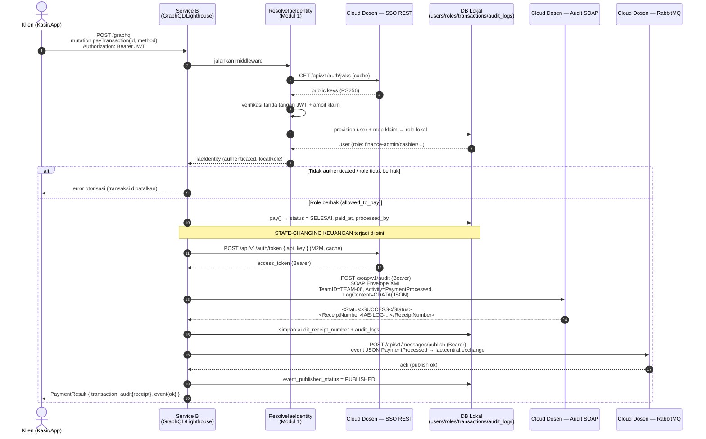
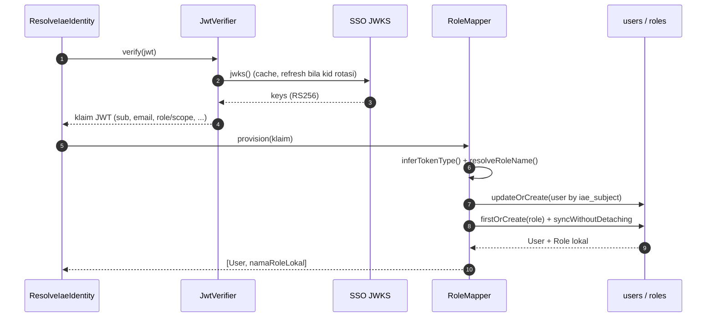

# Analisis Tugas 3 — Integrasi Aplikasi Enterprise

| Parameter | Nilai |
|-----------|-------|
| Mata Kuliah | BBK2HAB3 — Integrasi Aplikasi Enterprise |
| Mahasiswa | Hadid Hamar |
| Nomor Absen | 13 |
| Layanan (mini-service) | **Service B — Transaksi & Pembayaran (Smart Parking)** |
| Resource utama | `transactions` |
| Gaya API | **GraphQL** (Laravel + Lighthouse) |
| TeamID audit | `TEAM-06` |
| API Key M2M | `KEY-MHS-185` |
| Repository | https://github.com/Hdiddz/IAE-tugas3-Hadid-Hamar |

Dokumen ini menjelaskan **(1)** transaksi mana yang dinilai kritis dan mengapa, **(2)** skema pemetaan hak akses (role) lokal, dan **(3)** *sequence diagram* internal yang menggambarkan interaksi layanan dengan tiga sistem terpusat dosen (SSO, SOAP Audit, RabbitMQ).

---

## 1. Konteks Layanan

Service B adalah salah satu mini-service ekosistem **Smart Parking**. Tugas utamanya mengelola siklus hidup transaksi parkir:

```
tap-in (BERLANGSUNG)  →  checkout / tap-out (SUDAH_CHECKOUT)  →  pembayaran (SELESAI)
```

Pada GraphQL, ketiga tahap tersebut dipetakan ke mutation:

| Mutation | Efek state | Kritis? |
|----------|-----------|---------|
| `createTransaction` | membuat record baru, status `BERLANGSUNG` | Tidak (belum ada nilai uang final) |
| `checkoutTransaction` | menghitung biaya, status `SUDAH_CHECKOUT` | Tidak (kalkulasi, belum final) |
| **`payTransaction`** | **menyelesaikan pembayaran, status `SELESAI`** | **Ya — state-changing keuangan** |

---

## 2. Justifikasi Transaksi Kritis

### Transaksi kritis terpilih: `payTransaction` (PaymentProcessed)

`payTransaction` adalah transaksi yang **mengubah state keuangan secara final dan tidak dapat diulang (idempotent-sensitive)**. Sekali sebuah transaksi berstatus `SELESAI`:

1. **Uang berpindah.** `total_amount` dianggap telah dibayar (tunai/QRIS/e-wallet). Ini adalah peristiwa finansial yang harus tercatat permanen dan dapat diaudit.
2. **Sumber daya fisik dilepas.** Slot parkir di-`release` (memengaruhi ketersediaan slot di Service A) dan voucher ditandai terpakai (Service C). Kesalahan di sini berdampak lintas service.
3. **Tidak boleh terjadi diam-diam.** Karena menyangkut keuangan, setiap eksekusi wajib meninggalkan **jejak audit yang otoritatif** di sistem audit pusat (legacy SOAP) dan **disebarkan** ke departemen lain (Finance, Reporting, Notification) secara asinkron.

Bandingkan dengan `createTransaction`/`checkoutTransaction` yang hanya menyiapkan/menghitung data — keduanya masih bisa dikoreksi tanpa konsekuensi finansial, sehingga **tidak** tergolong kritis.

### Mengapa butuh SOAP (Modul 2)?

Sistem audit pusat dosen adalah **sistem legacy** yang hanya menerima **SOAP/XML** kaku. Transaksi keuangan (`PaymentProcessed`) wajib divalidasi & dicatat ke sistem ini karena bersifat *compliance/non-repudiation*: server mengembalikan **`ReceiptNumber`** sebagai bukti sah bahwa peristiwa keuangan telah terekam. Receipt ini disimpan kembali pada record transaksi lokal (`audit_receipt_number`).

### Mengapa butuh RabbitMQ (Modul 3)?

Setelah pembayaran sah, banyak departemen perlu *tahu* (Finance untuk rekap pendapatan, Reporting untuk dashboard, Notification untuk struk digital). Memanggil semua service itu secara sinkron akan **memperlambat** respons ke pengguna dan menciptakan *tight coupling*. Karena itu event `PaymentProcessed` di-**broadcast asinkron** ke `iae.central.exchange` (fire-and-forget). Pengguna mendapat konfirmasi cepat; konsumen event memproses di belakang layar.

> Ringkas: **SOAP = bukti audit yang harus dijamin (sinkron, butuh receipt).** **RabbitMQ = penyebaran kabar ke banyak pihak (asinkron, tidak menunggu).**

---

## 3. Skema Pemetaan Hak Akses (Role) Lokal

JWT dari Cloud Dosen (SSO) tidak mengenal role internal Service B. Modul 1 **memetakan klaim eksternal → role lokal** melalui `RoleMapper`, lalu menyimpan user federasi pada tabel `users` + `roles` (relasi `role_user`).

### Role lokal

| Role lokal | Asal pemetaan | Boleh `payTransaction`? |
|------------|---------------|-------------------------|
| `finance-admin` | klaim role `admin` / `finance` | ✅ Ya |
| `cashier` | klaim role `cashier` / `kasir` / `operator` | ✅ Ya |
| `service-account` | token **M2M** (`api_key` / `sub` `KEY-MHS-*`) | ✅ Ya |
| `customer` | token **end-user** warga / klaim `warga`,`user` | ✅ Ya — *self-service* (bayar parkir sendiri) |

> Catatan implementasi lab: pada deployment lab, key M2M (`KEY-MHS-185`) tidak aktif di server dosen, sehingga satu-satunya kredensial yang dapat menerbitkan JWT valid adalah **SSO Warga**. Karena itu role `customer` diizinkan menyelesaikan pembayaran parkirnya sendiri (model *self-service kiosk*), dan token warga tersebut dipakai sebagai Bearer untuk panggilan SOAP & RabbitMQ. Skema role tetap utuh: yang menjadi gerbang adalah **keabsahan JWT dari SSO dosen** — request tanpa token valid tetap ditolak.

### Aturan pemetaan (lihat `config/iae.php`)

1. Periksa klaim role/scope JWT (`role`, `roles`, `scope`, `realm_access.roles`, dst.) → cocokkan ke `claim_map` (prioritas privilege tertinggi lebih dulu).
2. Bila tidak ada klaim role, petakan berdasarkan **tipe token** (`m2m` → `service-account`, `user` → `customer`).
3. Bila tetap tidak cocok → `default` = `customer`.

### Penegakan otorisasi

`payTransaction` menolak request bila: (a) tidak ada Bearer JWT valid dari SSO dosen, atau (b) role lokal user **tidak** termasuk daftar `allowed_to_pay`. Inilah "skema pemetaan hak akses role lokal" yang mengamankan transaksi kritis. (Lihat catatan di §3 mengenai penyesuaian lab untuk role `customer`.)

---

## 4. Sequence Diagram Internal

### 4.1 Orkestrasi transaksi kritis `payTransaction` (alur utama)



### 4.2 Pemetaan SSO → role lokal (detail Modul 1)



---

## 5. Pemetaan Modul → Bukti Implementasi

| Modul | Bobot | Implementasi (file) | Bukti tersimpan |
|-------|------:|---------------------|-----------------|
| **1. Federated SSO** | 30% | `app/Http/Middleware/ResolveIaeIdentity.php`, `app/Services/JwtVerifier.php`, `app/Services/IaeSsoClient.php`, `app/Services/RoleMapper.php` | tabel `users`, `roles`, `role_user`; query `me` |
| **2. SOAP XML Client** | 40% | `app/Services/SoapAuditClient.php` (transformasi JSON→XML Envelope) | `audit_logs.receipt_number`, `transactions.audit_receipt_number` |
| **3. AMQP Publisher** | 20% | `app/Services/MessageBrokerClient.php` | `transactions.event_published_status`, field `event` pada `PaymentResult` |
| **4. Akuntabilitas Progres** | 10% | `AI_PROMPT_LOG.md` | dokumen log prompt AI |

Titik temu seluruh modul ada di resolver kritis **`app/GraphQL/Mutations/PayTransaction.php`**, yang mengorkestrasi SSO → SOAP → RabbitMQ persis seperti diagram pada §4.1.
