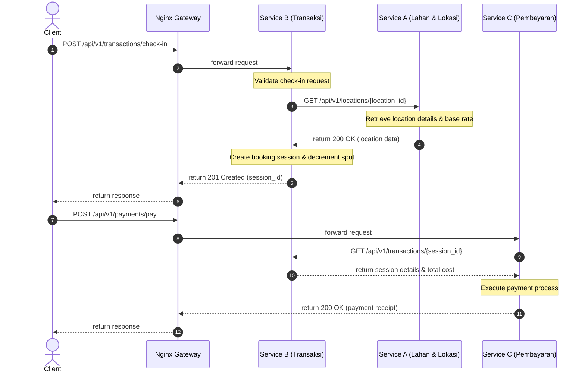

# 👥 Team & Member Services Agreement - Kelompok 6 / TEAM-06

This document lists the team structure, service responsibilities, and inter-service API contracts within the **Smart Parking System**.

---

## 📋 Team Mapping

Our group is split into three service responsibilities, each managed by a dedicated developer:

| Component | Service Name | Responsible Developer | NIM | Platform Tech Stack |
| --- | --- | --- | --- | --- |
| **Service A** | **Lahan & Lokasi** | **Farid Maulana** | **102022400039** | Laravel 11, PHP 8.2, MySQL |
| **Service B** | **Transaksi Parkir** | *Team Member B* | *NIM Member B* | Node.js / Python / Go / PHP |
| **Service C** | **Pembayaran** | *Team Member C* | *NIM Member C* | Node.js / Python / Go / PHP |

---

## 🛠️ Service Definitions & Boundaries

### 🚗 Service A: Lahan & Lokasi (Farid Maulana)
* **Responsibility**: Manages the static master records of parking spots. This includes adding new buildings, setting base fees, mapping addresses, and maintaining total capacity constraints.
* **Internal Docker Hostname**: `smart-parking-service-a-app`
* **Exposed Port (Docker internal)**: `3001`
* **Key Database Tables**: `locations`, `roles`, `audit_receipts`

---

### 📝 Service B: Transaksi Parkir (Placeholder)
* **Responsibility**: Tracks parking check-ins and check-outs. When a vehicle enters, Service B starts a session and decrements the `available_spots` for that location. When the vehicle exits, it computes duration and marks the spot as available.
* **Internal Docker Hostname**: `smart-parking-service-b-app`
* **Exposed Port (Docker internal)**: `3002`
* **Inter-Service Dependency**: Service B calls Service A's `GET /api/v1/locations/{id}` to verify the location exists, check its type (VIP vs. regular), and fetch the capacity limit and base rate.

---

### 💳 Service C: Pembayaran (Placeholder)
* **Responsibility**: Handles invoicing, digital wallets/cashless integration, and payment receipt storage. Once paid, it alerts Service B to conclude the parking session.
* **Internal Docker Hostname**: `smart-parking-service-c-app`
* **Exposed Port (Docker internal)**: `3003`
* **Inter-Service Dependency**: Service C calls Service B to retrieve active session costs and durations. Once payment completes, it triggers a `payment.completed` event via AMQP.

---

## 🤝 Inter-Service API Contract

Below is the agreed communication protocol between services:



### 📡 Standardized JSON Response Scheme
All services in Kelompok 6 agree to return JSON responses following this metadata wrapper scheme:

#### Success Response (e.g., HTTP 200/201)
```json
{
  "status": "success",
  "message": "Data retrieved successfully",
  "data": {
    "key": "value"
  },
  "meta": {
    "service_name": "Lahan-Lokasi-Service",
    "api_version": "v1"
  }
}
```

#### Error Response (e.g., HTTP 400/401/404/500)
```json
{
  "status": "error",
  "message": "Detailed error message here",
  "errors": [
    "Validation rule X failed",
    "Database constraint violation"
  ],
  "meta": {
    "service_name": "Lahan-Lokasi-Service",
    "api_version": "v1"
  }
}
```
